# Remote Administration & Support Lab

## Project Overview

This project demonstrates the configuration and troubleshooting of remote administration technologies within a VirtualBox lab environment.

The lab consists of an Ubuntu Linux virtual machine and a Windows 11 virtual machine. SSH was configured to allow secure command-line administration, while Remote Desktop Protocol (RDP) was configured to provide graphical remote access.

During implementation, network connectivity issues were encountered due to VirtualBox network configurations. These issues were investigated and resolved by modifying virtual network settings, verifying IP addressing, testing connectivity, and validating successful remote access.

The project demonstrates practical IT support skills including remote administration, network troubleshooting, connectivity testing, firewall configuration, and virtual machine management.

## Skills Demonstrated

- Remote Administration
- SSH
- Remote Desktop Protocol (RDP)
- Linux Administration
- Windows Administration
- VirtualBox
- Network Troubleshooting
- Firewall Configuration
- TCP/IP Networking
- Technical Documentation

## Technologies Used

* Ubuntu Linux
* Windows 11 ARM
* VirtualBox
* OpenSSH Server
* UFW Firewall
* Remmina
* Microsoft Remote Desktop (mstsc)
* ICMP (Ping)
* TCP/IP Networking

## Lab Environment

### Host Machine

* macOS

### Virtual Machines

* Ubuntu Linux VM
* Windows 11 ARM VM

### Remote Administration Tools

* SSH
* Remmina RDP Client
* Windows Remote Desktop Connection

## SSH Remote Administration

### Objective

Configure SSH on the Ubuntu virtual machine and verify that the Windows 11 virtual machine can remotely access the Ubuntu system through a secure command-line session.

### Steps Performed

1. Installed and enabled the OpenSSH Server on Ubuntu.
2. Verified the SSH service was running.
3. Configured Ubuntu Firewall (UFW) to allow SSH traffic.
4. Identified the Ubuntu IP address.
5. Connected from the Windows 11 VM using the SSH client.
6. Verified successful remote access.

### Evidence

#### Screenshot 01 - SSH Service Enabled

The OpenSSH Server service was verified on the Ubuntu virtual machine to confirm that SSH remote access was available and operational.

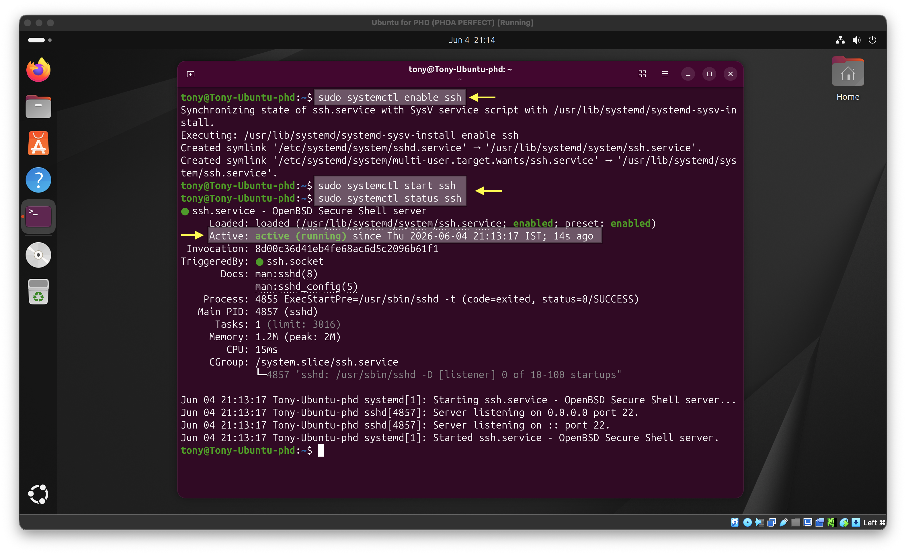

#### Screenshot 02 - UFW Firewall Rule

A firewall rule was added using UFW to allow inbound SSH connections on port 22 while maintaining system security.

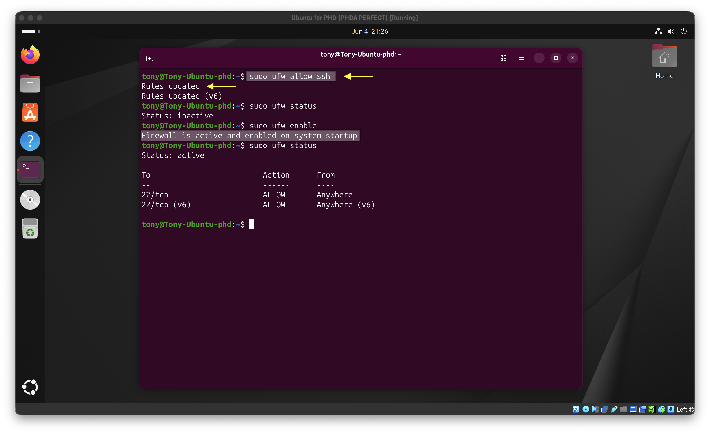

#### Screenshot 03 - NAT Network Configuration

The Ubuntu virtual machine was initially configured using a NAT network adapter. While internet connectivity was available, the Windows virtual machine could not directly communicate with the Ubuntu system using its private IP address.

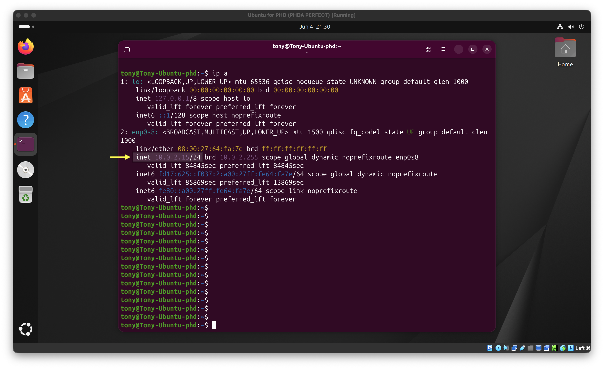

#### Screenshot 04 - Bridged Network Investigation

The VirtualBox network settings were reviewed and alternative network configurations were investigated to allow direct communication between virtual machines.

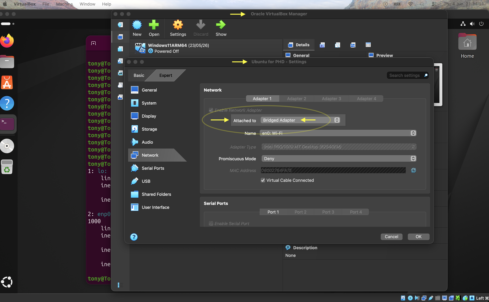

#### Screenshot 05 - Bridged Network Configuration

The Ubuntu virtual machine was configured to use a Bridged Adapter, allowing it to obtain an IP address directly from the home router. This made the Ubuntu system accessible from other devices on the local network for remote administration testing.

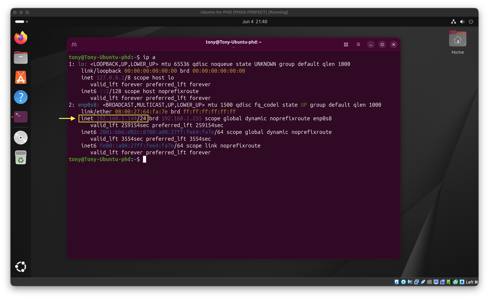

#### Screenshot 06 - Successful SSH Remote Login

After the network configuration was corrected, an SSH connection was successfully established from the Windows 11 virtual machine to the Ubuntu system using the OpenSSH client.

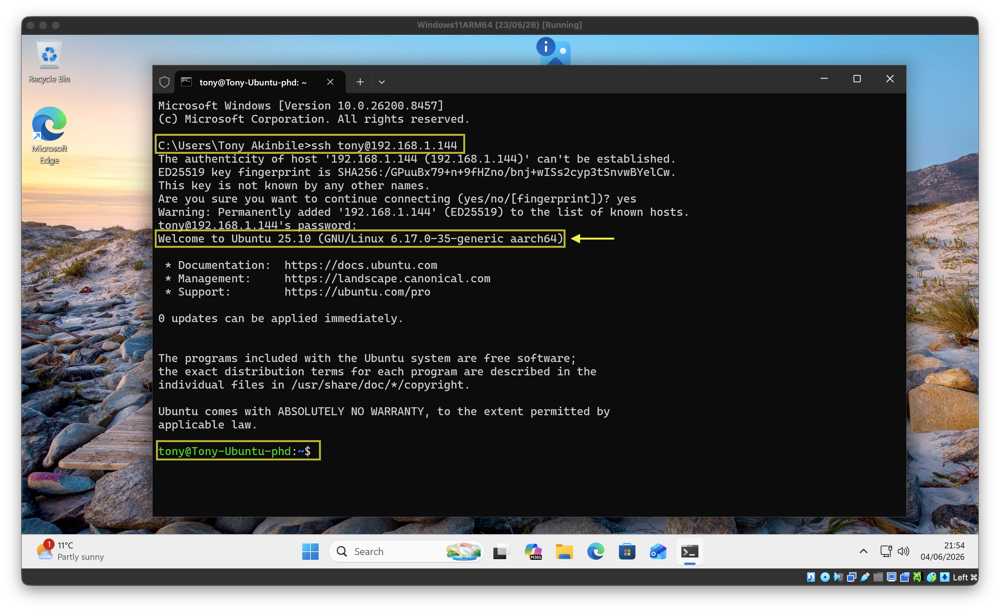

### Outcome

SSH remote administration was successfully configured and tested. The Windows 11 virtual machine was able to establish a secure remote command-line session with the Ubuntu virtual machine, demonstrating remote access, firewall configuration, IP addressing, and connectivity verification skills.

## Remote Desktop Protocol (RDP) Administration

### Objective

Configure Remote Desktop Protocol (RDP) access between the Ubuntu and Windows 11 virtual machines. Investigate connectivity issues, validate network configuration, and establish a successful remote desktop session.

### Steps Performed

1. Verified Remote Desktop was enabled on the Windows 11 virtual machine.
2. Installed the Remmina RDP client on Ubuntu.
3. Attempted an initial RDP connection.
4. Investigated IP addressing and network configuration.
5. Reconfigured VirtualBox networking where required.
6. Tested network connectivity between systems.
7. Authenticated successfully to the Windows virtual machine.
8. Verified successful remote desktop access.

### Evidence

#### Screenshot 07 - Remote Desktop Enabled

Remote Desktop was enabled on the Windows 11 virtual machine to allow remote graphical administration from another system.

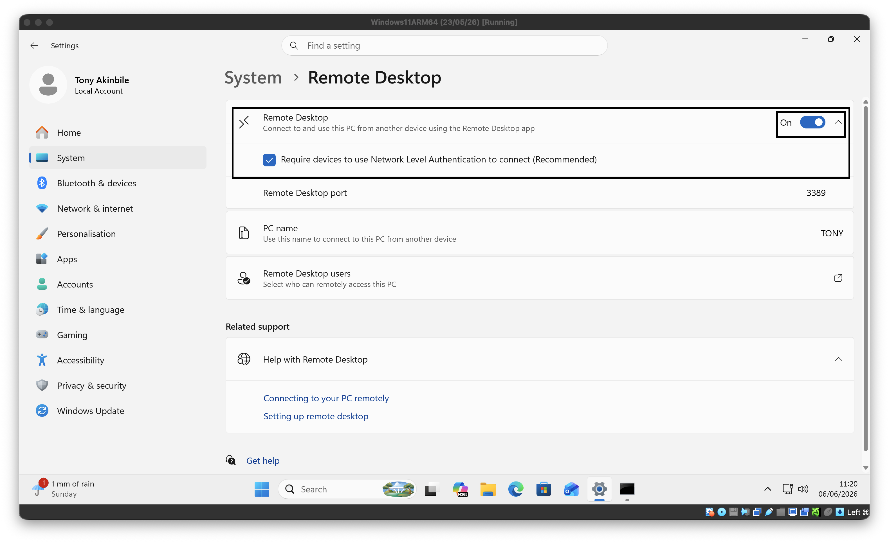

#### Screenshot 08 - Remmina RDP Client Installation

The Remmina Remote Desktop Client was installed on the Ubuntu virtual machine to provide RDP connectivity to Windows systems.

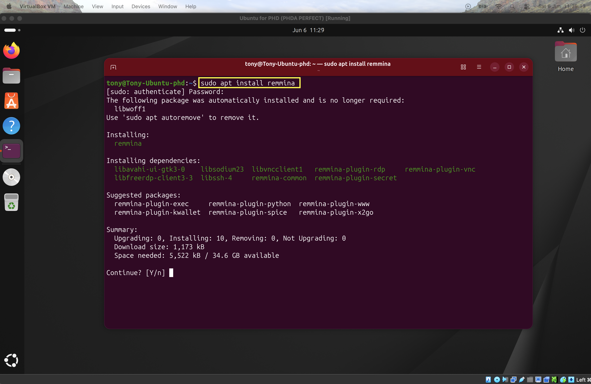

#### Screenshot 09 - Initial RDP Connection Attempt

An initial RDP connection attempt was made from the Ubuntu virtual machine using Remmina. During testing, it was identified that the Ubuntu and Windows virtual machines were operating on different network configurations, requiring further investigation.

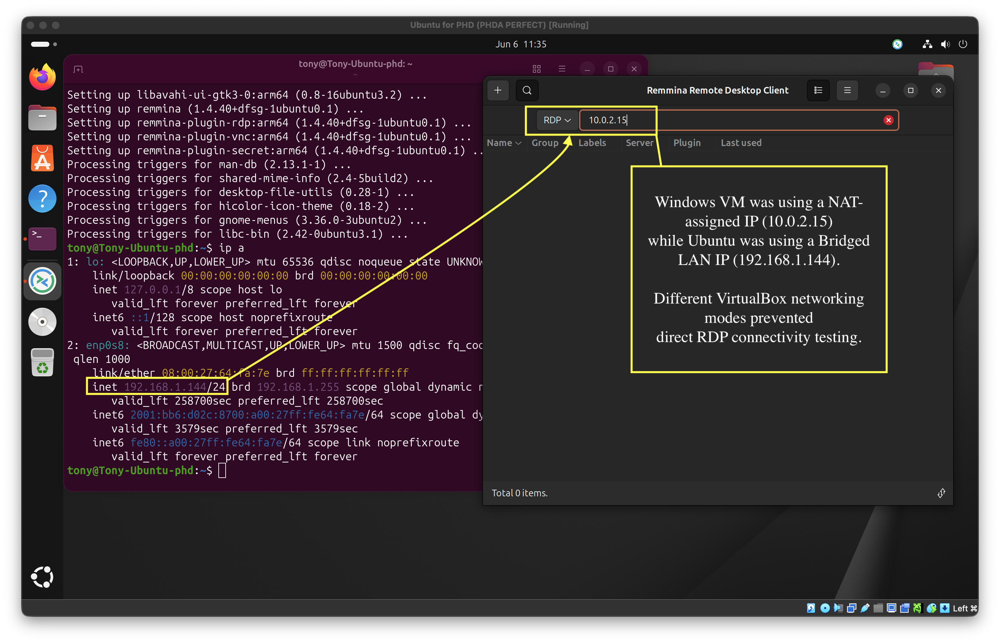

#### Screenshot 10 - Windows IP Configuration

The Windows virtual machine network configuration was reviewed using the ipconfig command. The results confirmed that the Windows system was operating on a different network segment from the Ubuntu virtual machine.

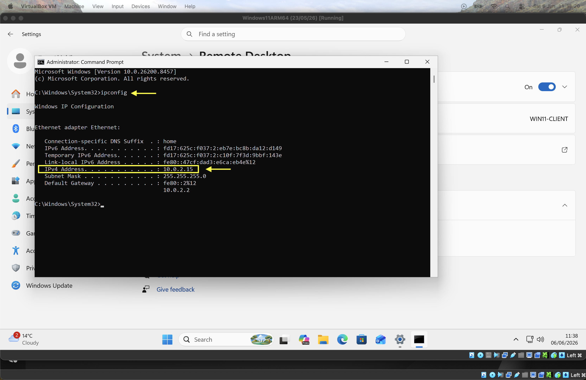

#### Screenshot 11 - Windows Network Reconfiguration

The Windows virtual machine network adapter was reviewed and reconfigured within VirtualBox. The adapter was changed to use Bridged Networking to place both virtual machines on the same network.

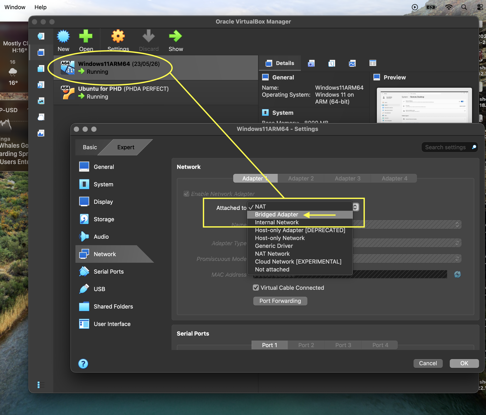

#### Screenshot 12 - Bridged Network Verification

Following the network reconfiguration, IP addressing was verified on both systems. The Ubuntu and Windows virtual machines successfully obtained IP addresses from the same network.

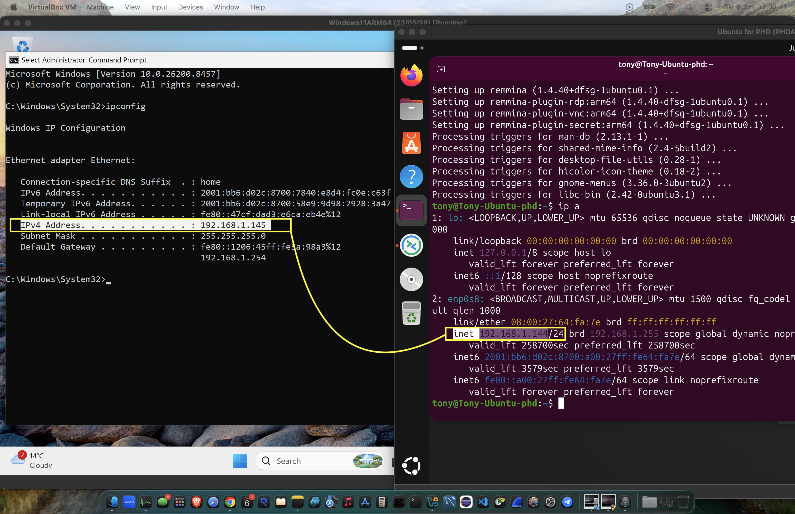

#### Screenshot 13 - Network Connectivity Test

Connectivity between the virtual machines was verified using the ping command. Successful responses confirmed communication between both systems and validated the updated network configuration.

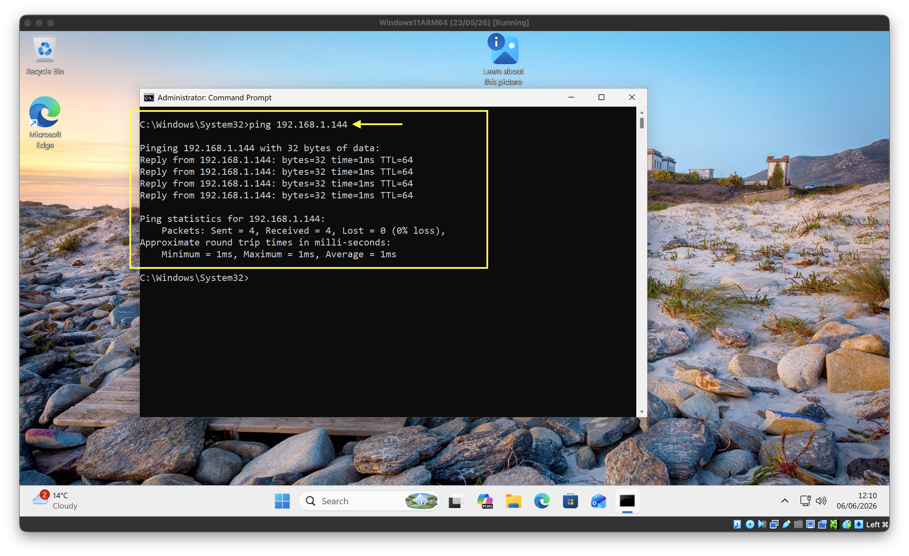

#### Screenshot 14 - RDP Authentication Prompt

After network connectivity was validated, the Windows virtual machine responded to the RDP request and presented an authentication prompt. This confirmed that the Remote Desktop service was accessible across the network.

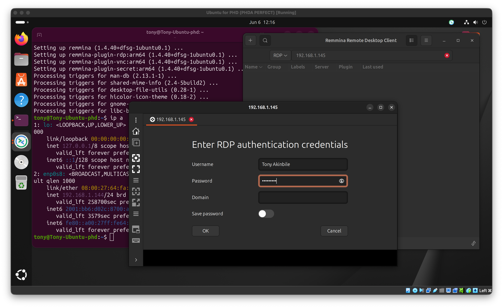

#### Screenshot 15 - Successful RDP Session

A successful Remote Desktop session was established from the Ubuntu virtual machine to the Windows 11 virtual machine using Remmina. The Windows desktop was displayed remotely, confirming successful graphical remote administration.

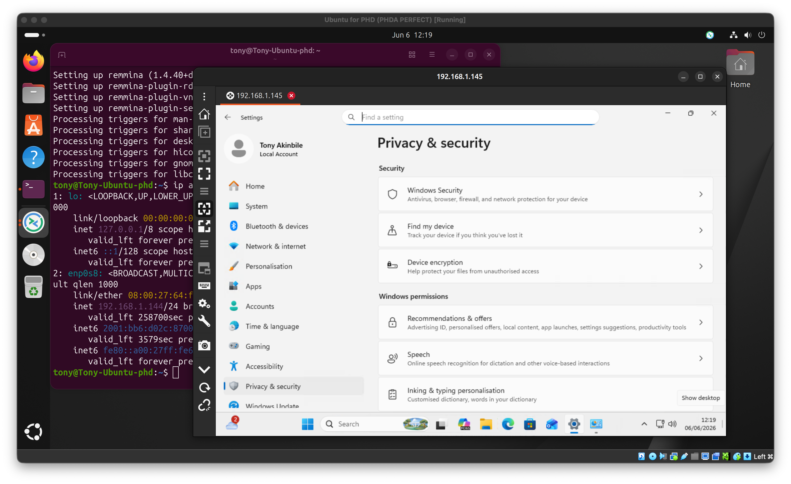

## Windows Remote Desktop Client Demonstration

### Objective

Demonstrate the use of Microsoft's built-in Remote Desktop Connection client (`mstsc`) commonly used by IT Support and Helpdesk Engineers to remotely access Windows systems.

#### Screenshot 16 - Open Windows RDP Client

The Windows Run dialog was used to launch the Microsoft Remote Desktop client using the `mstsc` command.

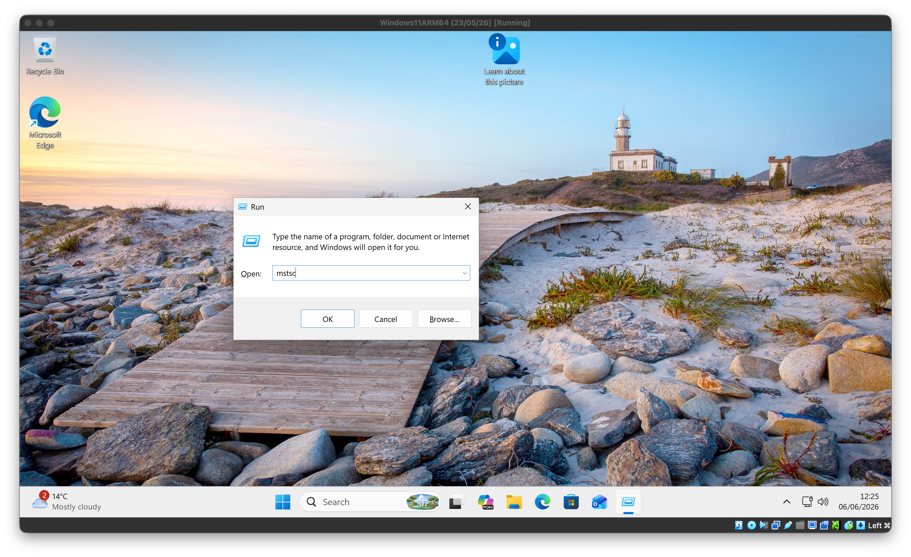

#### Screenshot 17 - Configure RDP Connection

The Remote Desktop Connection application was opened and configured with a target IP address to demonstrate the process of initiating a remote support session.

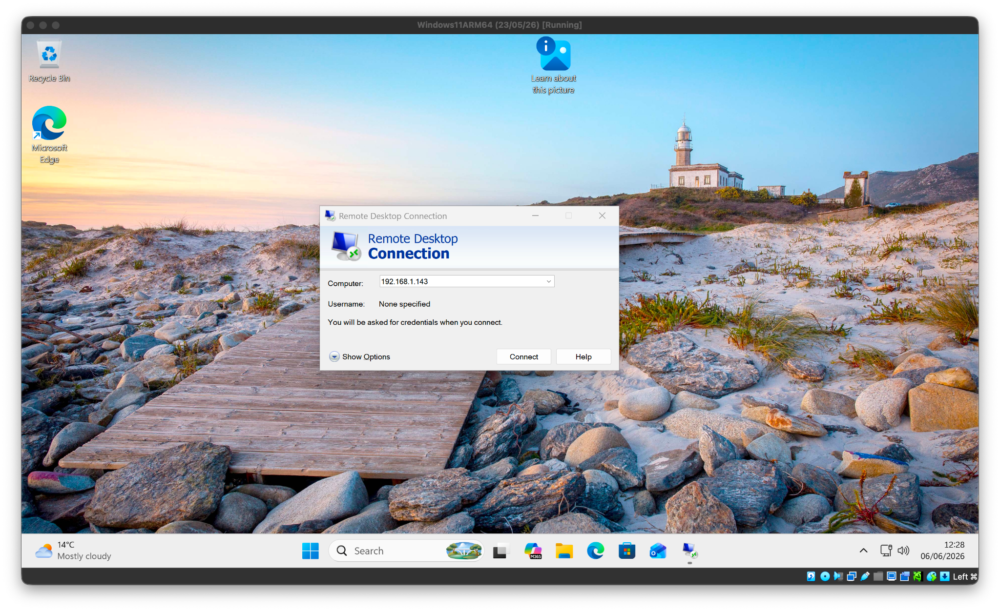

### Outcome

This demonstration shows familiarity with Microsoft's native Remote Desktop tools used by support engineers to connect to user workstations and servers for remote troubleshooting and administration.

## Conclusion

This project demonstrates the successful implementation of SSH and Remote Desktop administration within a virtualized environment. During the project, network connectivity issues were identified and resolved through IP verification, VirtualBox network reconfiguration, and connectivity testing. The completed lab demonstrates practical skills in remote administration, troubleshooting, networking, and IT support.

